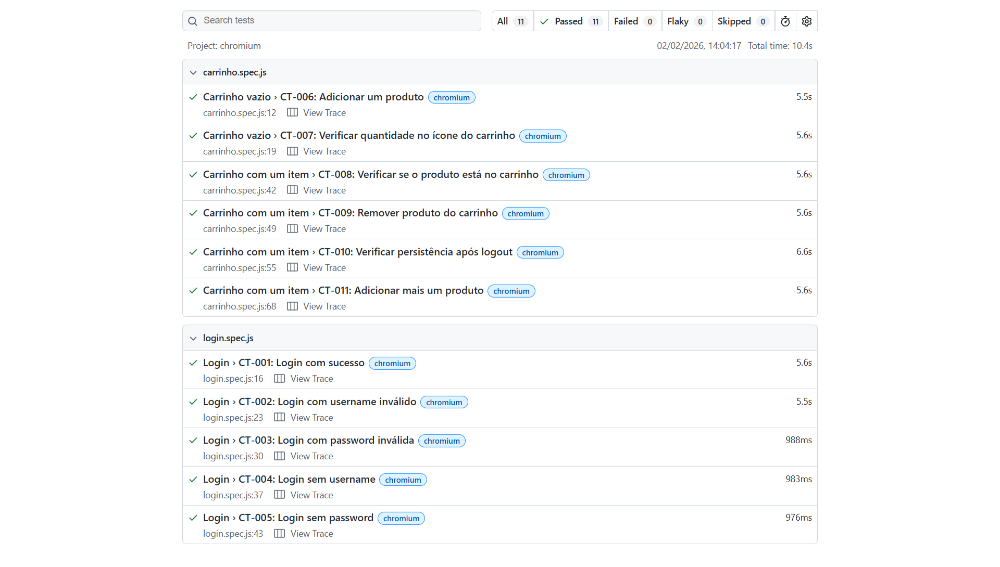

# Automação de testes E2E - SauceDemo (Playwright)


Este repositório contém a automação de testes de interface (UI) para o site [SauceDemo](https://www.saucedemo.com/), uma aplicação de demonstração de e-commerce. O foco do projeto é validar os fluxos críticos de **Login** e **Gerenciamento de Carrinho**.

## Tecnologias e ferramentas
* **Linguagem:** JavaScript
* **Framework:** [Playwright](https://playwright.dev/)
* **Padrão de Escrita:** BDD (Behavior Driven Development) com Gherkin
* **Evidências:** Screenshots e vídeos (em caso de falha)
* **Relatórios:** Playwright HTML Reporter

## Estrutura do projeto
```text
├── docs/                # Documentação BDD (Arquivos .feature)
├── tests/               # Scripts de automação (.spec.js)
├── .gitignore           # Filtro de arquivos para o Git
├── playwright.config.js # Configurações globais do framework
├── package.json         # Dependências e scripts do projeto
└── README.md            # Documentação principal
```

## Cenários de teste (Gherkin/BDD)
A estratégia de teste foi desenhada utilizando a linguagem Gherkin para garantir que os requisitos de negócio fossem validados. Os arquivos de especificação estão na pasta docs/:

- **Login**: Validações de acesso com sucesso, usuário inválido, senha incorreta e campos vazios (Cenários CT-001 ao CT-005).
- **Carrinho**: Adição de itens, remoção, contador de badge e persistência de dados após logout (Cenários CT-006 ao CT-011).

## Pré-requisitos
Antes de começar, você precisará ter instalado em sua máquina: **Node.js (Versão 18 ou superior)**

## Instalação e execução
Clone o repositório:

```bash
git clone https://github.com/oipamelaoliveira/automacao-saucedemo-playwright-bdd
```
Entre na pasta do projeto:

```bash
cd automacao-saucedemo-playwright-bdd
```
Instale as dependências:

```bash
npm install
```
Instale os navegadores do Playwright:

```bash
npx playwright install
```
Execute todos os testes:

```bash
npx playwright test
```
Abra o relatório de testes:

```bash
npx playwright show-report
```
## Resultados dos testes


## Estratégia de evidências
O projeto está configurado para ser eficiente no consumo de recursos e facilitar o debug:

- Screenshots: Capturados automaticamente apenas quando um teste falha.
- Vídeos: Gravados e mantidos apenas em caso de erro (retain-on-failure).
- Traces: O arquivo de trace (caixa-preta do erro) é gerado na primeira tentativa de reexecução de um teste falho, permitindo análise detalhada da DOM e rede.

## Aprendizados e habilidades aplicadas
Este projeto foi fundamental para consolidar conceitos de QA Automation:

- Organização de Testes: Uso de blocos describe, context e beforeEach para código limpo e modular.
- Validações Robustas: Implementação de asserções negativas (not.toBeVisible) e verificações de estado dinâmico.
- Documentação Viva: Escrita de cenários BDD que servem tanto como guia de desenvolvimento quanto como manual de negócio.
- CI/CD Ready: Projeto estruturado com .gitignore e configurações prontas para integração contínua.
